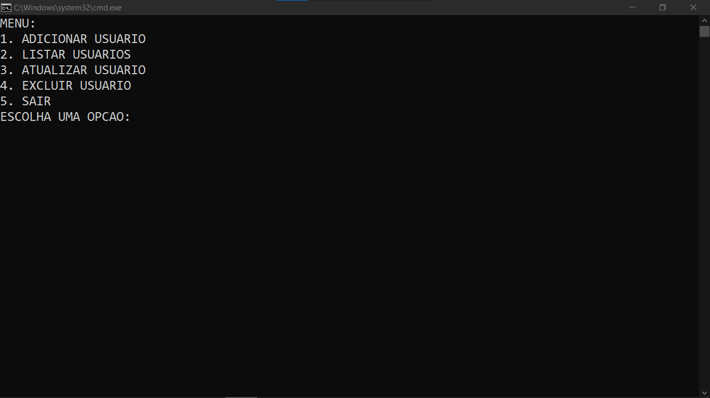
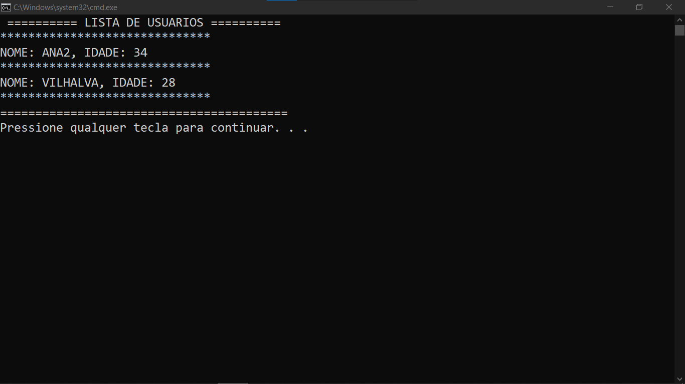

# CRUD BAT EM TXT
👨‍🏫O APLICATIVO É UM SISTEMA BÁSICO DE GERENCIAMENTO DE USUÁRIOS IMPLEMENTADO EM BATCH SCRIPT.

  
  

## DESCRIÇÃO:
O aplicativo é um sistema básico de gerenciamento de usuários implementado em `BATCH SCRIPT`, utilizando um paradigma de CRUD (Create, Read, Update, Delete) para realizar operações simples em um arquivo de texto `txt`.

## FUNCIONALIDADES:
1. **Adicionar Usuário:**
   - Permite a adição de um novo usuário ao sistema.
   - Solicita o nome e a idade do usuário por meio da entrada do usuário.
   - Os dados do usuário são armazenados em um arquivo de texto chamado `"usuarios.txt"` no mesmo diretório do código.

2. **Listar Usuários:**
   - Exibe uma lista de todos os usuários cadastrados no sistema.
   - Recupera as informações do arquivo `"usuarios.txt"` e apresenta o nome e a idade de cada usuário.

3. **Atualizar Usuário:**
   - Permite a atualização das informações de um usuário existente.
   - Solicita o nome do usuário a ser atualizado e os novos dados (nome e idade).
   - Atualiza o arquivo `"usuarios.txt"` com as informações atualizadas.

4. **Excluir Usuário:**
   - Possibilita a exclusão de um usuário do sistema.
   - Solicita o nome do usuário a ser excluído e remove suas informações do arquivo `"usuarios.txt"`.

5. **Persistência de Dados:**
   - Utiliza manipulação de arquivos para armazenar as informações dos usuários de forma persistente.
   - O arquivo `"usuarios.txt"` é criado automaticamente se não existir no mesmo diretório do código.

6. **Interface de Texto Simples:**
   - A interação com o aplicativo é realizada por meio de um menu de texto simples, apresentando opções numeradas.
   - O usuário escolhe a operação desejada digitando o número correspondente.

7. **Encerramento Controlado:**
   - Permite ao usuário sair do aplicativo de maneira controlada, encerrando o programa de acordo com sua escolha.

## EXECUTANDO O PROJETO:
1. **Executar o Script:**
   - Navegue até o diretório `./CODIGO/CODIGO.bat`.
   - Dê um duplo clique no arquivo para executá-lo. Isso abrirá uma janela do Prompt de Comando.

2. **Uso do Menu:**
   - Quando o script for executado, o menu principal será exibido.
   - **Digite `1` e pressione Enter** para adicionar um usuário.
     - Você será solicitado a digitar o nome e a idade do usuário. Digite os dados e pressione Enter.
   - **Digite `2` e pressione Enter** para listar todos os usuários cadastrados.
   - **Digite `3` e pressione Enter** para atualizar as informações de um usuário.
     - Você será solicitado a fornecer o nome do usuário que deseja atualizar, o novo nome e a nova idade.
   - **Digite `4` e pressione Enter** para excluir um usuário.
     - Você será solicitado a fornecer o nome do usuário que deseja excluir.
   - **Digite `5` e pressione Enter** para sair do programa.

3. **Observações:**
   - **Arquivo de Dados:** O script cria e usa um arquivo chamado `usuarios.txt` no mesmo diretório onde o script é executado. Este arquivo armazena os dados dos usuários.
   - **Estrutura do Arquivo:** Cada linha do arquivo `usuarios.txt` contém o nome e a idade de um usuário, separados por uma vírgula.
   - **Erros e Mensagens:** O script fornece feedback sobre as ações realizadas, como sucesso ou falha na adição, atualização ou exclusão de usuários.

## NÃO SABE?
- Entendemos que para manipular arquivos em muitas linguagens e tecnologias, é necessário possuir conhecimento nessas áreas. Para auxiliar nesse aprendizado, oferecemos cursos gratuitos disponíveis:
* [CURSO DE BATCH SCRIPT](https://github.com/VILHALVA/CURSO-DE-BATCH-SCRIPT)
* [CONFIRA MAIS CURSOS](https://github.com/VILHALVA?tab=repositories&q=+topic:CURSO)

## CREDITOS:
- [PROJETO BASEADO NO "CRUD PYTHON EM TXT"](https://github.com/VILHALVA/CRUD-PYTHON-EM-TXT)
- [PROJETO FEITO PELO VILHALVA](https://github.com/VILHALVA)

